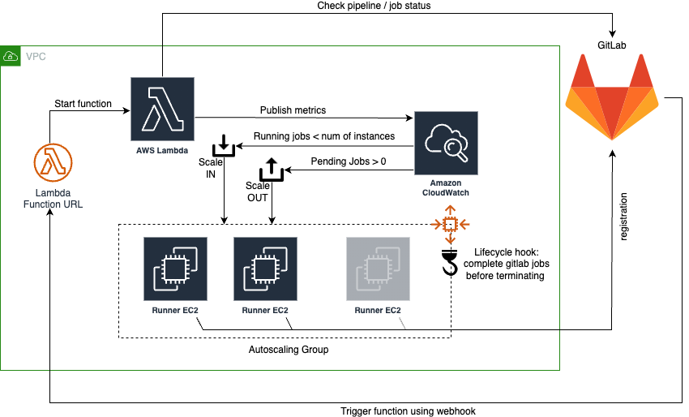
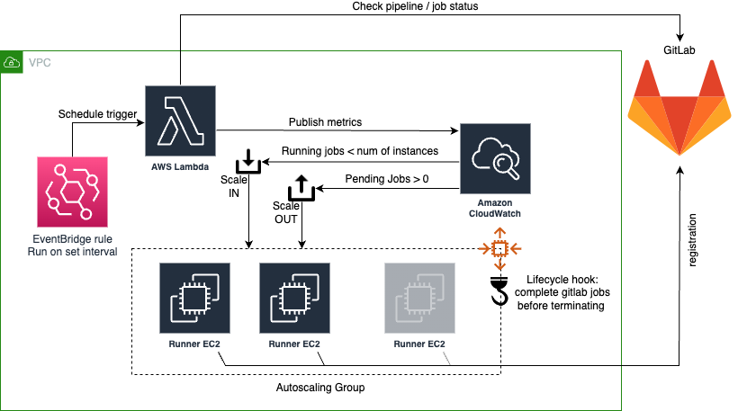

# GitLab runners in Autoscaling

Minimal cost scalable linux GitLab runners deployed into AWS.

## Overview

This module creates a set of GitLab runners via an autoscaling group. The autoscaling group scales depending on the
number of GitLab pending jobs and the "load" on the instances.

A lambda is in charge of collecting GitLab related metrics and pushing to CloudWatch to trigger the scaling policies
based on pipeline activity. The function can be triggered by either running on a timer using an
[EventBridge rule](https://docs.aws.amazon.com/eventbridge/latest/userguide/eb-rules.html) and / or triggered by a
[GitLab webhook](https://docs.gitlab.com/ee/user/project/integrations/webhooks.html) calling out to the lambda
[function url](https://docs.aws.amazon.com/lambda/latest/dg/lambda-urls.html).

The autoscaling group makes use of lifecycle hook to ensure that every time a runner is asked to terminate by the
scaling-in operation, it completes the assigned job before deregistering from GitLab and terminating. A timeout
configuration is provided to ensure runners are not stuck in a loop waiting to terminate costing money.

New runners take ~5-6 minutes to register with GitLab. This is due to:

* Time for CloudWatch alarm to trigger (~30 seconds),
* Time for AutoScale to be triggered from alarm (~10 seconds),
* Delay in instance launch (~1 minute),
* Time to execute CloudInit to bootstrap instance with required tools and register the runner (~3-4 minutes). This can
be sped up by providing a `asg.image_id` with the required tooling already bootstrap.

The runner [executors](https://docs.gitlab.com/runner/executors/) can be either:

* [docker](https://docs.gitlab.com/runner/executors/docker.html) or
* [shell](https://docs.gitlab.com/runner/executors/shell.html).

Only one can be used, if you need to make use of the different executor a separate deployment is required.

### Operating System Support

Currently only linux based x86_64 (amd64) operating system are supported for the runners. The code has been tested
against the following but is likely to work with other variants and versions:

* Amazon Linux (2)
* RedHat (9)
* Debian (11)
* Ubuntu (22.04)

## Strategies

The module can be deployed multiple times into a VPC or AWS account depending on your use case. Multiple use cases may
include using different runner types for specific [tags](https://docs.gitlab.com/ee/ci/yaml/#tags) or separation of IAM
permissions.

**NOTE:** Both strategies can be used in parallel within the same deployment.

### Webhook



GitLab is configured with the endpoint of the lambda function. On events in GitLab the server calls out to the webhook
which triggers the execution of the lambda. This method is effective and minimal as there are no unnecessary executions
of the lambda function and it is faster to respond to the need for additional runners.

### Polling via EventBridge



EventBridge in AWS is configured to run at a set rate and trigger the lambda function. This method is useful when you
cannot use webhooks to call the function URL (possibly for security) or want to batch trigger runner creation /
termination.

## GitLab Tokens

In order for both the runner (EC2) to register and the lambda to check the queue we need to use tokens from GitLab.

`gitlab.api_token_ssm_path` and `gitlab.runner_registration_token_ssm_path` are both manually created paths in
[AWS Systems Manager Parameter Store](https://docs.aws.amazon.com/systems-manager/latest/userguide/systems-manager-parameter-store.htm).
Use the default KMS key or ensure the lambda and EC2 have access to decode the parameter.

* `api_token_ssm_path`: Is a _Project Access Token_ with _read_api_ as _Guest_ permissions created in the repository
the runner checks the job queue. Ensure sufficient expiry is provided for the token. **NOTE:** To use the _Guest_ role
here the _Public pipelines_ in _Settings_ -> _CI/CD_ -> _General pipelines_ must be ticked. Otherwise _Reporter_ role
can be used.
* `runner_registration_token_ssm_path`: Is found by navigating to _Settings_ -> _CI/CD_ -> _Runners_ ->
_registration token_ of the repository the runner will connect to.

Manually upload these into AWS with a given _Name_ (path) within Parameter Store and update the values of
`api_token_ssm_path` and `runner_registration_token_ssm_path` respectively.

## Cost Estimation

Both methods are cost effective for managing the runners due to the low (if not zero) cost of running the lambda
function to check the job queues. Spot instances can also be be used to reduce running EC2 cost.

Cost indications are effective as of 17/11/2022.

### Lambda

Running the lambda via (In the `ap-southeast-2` region):

* x86 architecture
* 1 request per minute
* 2000ms duration
* 128mb memory allocated
* 512mb ephemeral storage (default)

With the free tier this would cost $0.00 a month.

Without the free tier $0.19 USD:

> Number of requests: 1 per minute * (60 minutes in an hour x 730 hours in a month) = 43800 per month
Amount of memory allocated: 128 MB x 0.0009765625 GB in a MB = 0.125 GB
Amount of ephemeral storage allocated: 512 MB x 0.0009765625 GB in a MB = 0.5 GB
Pricing calculations
43,800 requests x 2,000 ms x 0.001 ms to sec conversion factor = 87,600.00 total compute (seconds)
0.125 GB x 87,600.00 seconds = 10,950.00 total compute (GB-s)
Tiered price for: 10950.00 GB-s
10950 GB-s x 0.0000166667 USD = 0.18 USD
Total tier cost = 0.1825 USD (monthly compute charges)
43,800 requests x 0.0000002 USD = 0.01 USD (monthly request charges)
0.50 GB - 0.5 GB (no additional charge) = 0.00 GB billable ephemeral storage per function
0.1825 USD + 0.01 USD = 0.19 USD
Lambda costs - Without Free Tier (monthly): 0.19 USD

### Runner (EC2)

See [Amazon EC2 On-Demand Pricing](https://aws.amazon.com/ec2/pricing/on-demand/) for up to date pricing.

Running the lambda via (In the `ap-southeast-2` region):

* A `t3.medium` spot instance(s) 5 hours over the month at the average price of $0.0158 is $0.079 a month
* A `t3.medium` on demand instance(s) 5 hours over the month at the average price of $0.0528 is $0.264 a month

The spot instance pricing provides a ~70% discount for this instance type.

## Python dependencies

`Python 3` and `pip` are required during the apply to download the necessary python dependencies used by the lambda
function. The `provisioner` defines the environment to run the commands in; either `local` (default) or `container`.
When using `local` ensure `python3` and `pip` are installed on the local machine. For `container` ensure a `docker`
compliant cli / container runtime is available and the necessary container will be pulled from the internet during the
_apply_. Both options are provided to allow for those who have access to install tooling locally and the other for those
who cannot but have docker.

## Design Considerations

During the creation some design decisions were made and are documented. These also include how and why various AWS
services have been configured to work within the required use cases.

### Function URL vs EventBridge with polling

The lambda can be triggered by either the [webhook](#webhook) and or the
[polling via EventBridge](#polling-via-eventbridge).

The webhook is:

* Faster to respond to events as it runs ~instantly.
* Cheaper if the repository / runner activity is low as the lambda will be infrequently executed
* Could be abused via third parties executing the function without security permissions. See
[Function URL and security](#function-url-and-security) below.

EventBridge is:

* More predictable in terms of AWS spend.
* Slow to respond
* Lower cost if the GitLab project activity is high

Making use of both can provide benefits, for example to ensure that runners are not kept running at night using
EventBridge (execute at 9pm UTC every day `cron(0 21 * * * *)`) while using the endpoint to respond to pipeline events
immediately.

## Function URL and security

A [function url](https://docs.aws.amazon.com/lambda/latest/dg/lambda-urls.html) is configured with
`authorization_type = "NONE"`, in effect no security is applied so can accessed by anything on the internet. This is
because the only other option of `AWS_IAM` can only be used when the caller provides IAM credentials passed into the
request. Unfortunately GitLab webhooks, even when running in AWS, does not have such capability. Custom logic can be
added into the function to constrain the incoming IPs but this still requires the lambda to execute. No whitelisting
functionality preventing lambda execution exists.

Aside from function overuse (leading to potential higher lambda cost) the function URL does not return any data so this
will not cause any exposure of data or private information. The lambda function is limited to 1 parallel execution so it
is unlikely to cause additional strain on your GitLab instance.

See [url auth](https://docs.aws.amazon.com/lambda/latest/dg/urls-auth.html) for more details.

### Lambda concurrency

As mentioned in [Function URL and security](#function-url-and-security) the lambda is restricted to _1_ parallel
execution. This is to prevent abuse of the URL but has the impact of possible _429_ _TooManyRequestsException_ or _Rate
exceeded_ errors in the GitLab webhooks UI. These can be ignored as each execution checks all relevant jobs, regardless
of the webhook and this will provide metrics for all required jobs.

See [lambda concurrency](https://docs.aws.amazon.com/lambda/latest/dg/configuration-concurrency.html) for more
information.

## Hours ago check

The lambda function contains a check which can be configured using `gitlab.activity_since_hours`. It is used to
determine if this project has activity (commits) since a specific period, if not, its currently active jobs are ignored.
This is an optimisation of API calls to GitLab. If you wish to ignore this check, set `activity_since_hours` to `8760`
(1 year in hours).

### Scaling Out

CloudWatch metrics are pushed by the lambda function and monitored with alarms. The lambda function pushes a metric of
the number of pending jobs and the autoscaler will deploy instances, maximum 2 at a time. The alarm is configured with a
period of _60 seconds_ with _1_ evaluation. This means every minute, if this metric is over the value of _0_, trigger
into alarm. This allows us to respond to an increase of runners within a maximum of 60 seconds from lambda execution.
60 seconds with 1 evaluation is the shortest period of time to trigger an alarm and is used to ensure scaling out is as
fast and responsive as possible. The runners will continue to scale out if the alarm is still in trigger, the max number
of instances has not been reached and the previous scale event has passed the warmup. The scale out retrigger time can
be decreased by changing the value of `asg.scaling_warmup`.

See [Set the default instance warmup for an Auto Scaling group](https://docs.aws.amazon.com/autoscaling/ec2/userguide/ec2-auto-scaling-default-instance-warmup.html)
for more details on scaling warmup.

### Scaling In

Scaling in runners makes use of
[avoiding premature transition](https://docs.aws.amazon.com/AmazonCloudWatch/latest/monitoring/AlarmThatSendsEmail.html#CloudWatch-alarms-avoiding-premature-transition)
within CloudWatch alarms. We are trying to balance keeping runners active without the need to recreate a runner for each
job as the warm up time could lead to frustration. The CloudWatch alarm is set to trigger when the runner load is under
_80%_ (math based on number of active runners and jobs in the queue), a period of _60 seconds_ with _N_ number of
evaluations, treating missing data as missing. The AWS alarms include logic to try to avoid false alarms, where the
alarm goes into _ALARM_ state prematurely when data is intermittent. Thus, if the lambda places a metric under _80_ the
alarm will wait _N_ periods before alarming (the latest time possible for it not to go into alarm). If any metric above
this threshold is added the alarm "timer" will effectively be reset. This means you need _N_ minutes of inactivity
before full scale in, keeping runners available for new jobs. This configuration is set by defining
`gitlab.runner_idletime` (defined in minutes) with no upper limit. The tradeoff with a longer idle time is additional
cost of runners when they are not needed. Conversely a lower time may lead to churn of instances leading to a large
number of jobs in the queue and longer wait times to execute jobs. The runners will continue to scale in until the alarm
is back in the _OK_ or _INSUFFICIENT\_DATA_ state or the minimum runner count is reached.

#### Scale in force

With the use of [lifecycle-hooks](https://docs.aws.amazon.com/autoscaling/ec2/userguide/lifecycle-hooks.html) we ensure
that runners are not terminated while a job is running. The autoscaler will, in the event jobs have been completed and
fewer are required, scale in the runner group. With the autoscaler we are unable to target a specific instance to
terminate. To overcome this a script executing on the runner blocks the termination and notifies the lifecycle hook when
the job completes allowing the continuation of the termination. You can set the time to wait and forcible delete the
instance using `asg.force_instance_deletion_time` (in seconds). The impact of a small number here is that long running
jobs may be terminated mid execution. If you require long execution times the value can be set to a maximum of _7200_
(2 hours). There is no penalty for having a longer period as instances will still be terminated once their job finishes
it execution (if the autoscaler scales in).

## Python dependency building

The lambda function requires dependant packages which are not bundled with the source code (to reduce space used by the
repository). During the plan and apply cycle the dependencies are downloaded and placed with the function code. The code
attempts to make this process as simple and quick as possible trying to avoid redownloads. As terraform does not contain
a function to check filesystem changes, we `sha256` each of the files in the directory recursively. We then join the
_shas_ together and `sha265` again to ensure we have a single unique checksum. If any module (either not present or
changed), requirement or source code is changed the `sha265` will also change triggering a rebuild. We ignore the lambda
zip file itself to ensure we do not run into a cycle of checksum changes. The downside is the rebuild will trigger twice
if a new module is downloaded (the `./.terraform/` directory is created) as the download of the modules on the
first run will change the checksum.

## Example

The following code illustrates an usage example of this module. Additional examples can be found within
[examples](./examples):

```tf
module "gitlab-runner" {
  source = "./"

  asg = {
    associate_public_ip_address = true
    instance_type               = "t3.micro"
    job_policy                  = <<EOF
{
    "Version": "2012-10-17",
    "Statement": [
        {
            "Action": [
                "ec2:DescribeInstances",
                "ssm:*"
            ],
            "Effect": "Allow",
            "Resource": "*"
        }
    ]
}
EOF
    max_size   = 1
    min_size   = 0
    spot_price = "0.0100"
    subnet_ids = ["subnet-xxx", "subnet-xxx", "subnet-xxx"]
  }

  gitlab = {
    api_token_ssm_path                 = "/gitlab/api_token"
    log_level                          = "debug"
    runner_agents_per_instance         = 1
    runner_registration_token_ssm_path = "/gitlab/runner_registration_token"
    uri                                = "https://gitlab.com/"
  }

  lambda = {
    memory_size = 128
    rate        = "rate(1 minute)"
    runtime     = "python3.8"
  }
}
```

## Module Management

### Code format

Ensure the code is correctly formatted using:

```bash
terraform fmt -recursive
```

or

```bash
make format
```

Manual formatting instructions:

* Attributes within definitions blocks should alphabetically sorted
* Docs are regenerated (see below)

### Docs

[terraform-docs.io](https://terraform-docs.io/) is used to generate the docs for the module. To download the binary:

```bash
curl -Lo ./terraform-docs.tar.gz https://github.com/terraform-docs/terraform-docs/releases/download/v0.16.0/terraform-docs-v0.16.0-$(uname)-amd64.tar.gz
tar -xzf terraform-docs.tar.gz
chmod +x terraform-docs
mv terraform-docs /usr/local/terraform-docs
```

To regenerate the docs run from the root of the module:

```bash
terraform-docs .
```

or

```bash
make docs
```

The [.terraform-docs.yml](./.terraform-docs.yml) contains the required settings.

<!-- BEGIN_TF_DOCS -->
## Requirements

| Name | Version |
|------|---------|
| <a name="requirement_terraform"></a> [terraform](#requirement\_terraform) | >= 1.3.0 |
| <a name="requirement_archive"></a> [archive](#requirement\_archive) | 2.2.0 |
| <a name="requirement_aws"></a> [aws](#requirement\_aws) | ~> 4.0 |
| <a name="requirement_local"></a> [local](#requirement\_local) | 2.2.3 |
| <a name="requirement_null"></a> [null](#requirement\_null) | 3.2.0 |
| <a name="requirement_random"></a> [random](#requirement\_random) | 3.4.3 |

## Providers

| Name | Version |
|------|---------|
| <a name="provider_archive"></a> [archive](#provider\_archive) | 2.2.0 |
| <a name="provider_aws"></a> [aws](#provider\_aws) | ~> 4.0 |
| <a name="provider_null"></a> [null](#provider\_null) | 3.2.0 |
| <a name="provider_random"></a> [random](#provider\_random) | 3.4.3 |

## Modules

No modules.

## Resources

| Name | Type |
|------|------|
| [aws_autoscaling_group.runner](https://registry.terraform.io/providers/hashicorp/aws/latest/docs/resources/autoscaling_group) | resource |
| [aws_autoscaling_lifecycle_hook.hook](https://registry.terraform.io/providers/hashicorp/aws/latest/docs/resources/autoscaling_lifecycle_hook) | resource |
| [aws_autoscaling_policy.gitlab_runners_scale_in](https://registry.terraform.io/providers/hashicorp/aws/latest/docs/resources/autoscaling_policy) | resource |
| [aws_autoscaling_policy.gitlab_runners_scale_out](https://registry.terraform.io/providers/hashicorp/aws/latest/docs/resources/autoscaling_policy) | resource |
| [aws_cloudwatch_event_rule.lambda_push_gitlab_pending_jobs_metric](https://registry.terraform.io/providers/hashicorp/aws/latest/docs/resources/cloudwatch_event_rule) | resource |
| [aws_cloudwatch_event_target.lambda_push_gitlab_pending_jobs_metric](https://registry.terraform.io/providers/hashicorp/aws/latest/docs/resources/cloudwatch_event_target) | resource |
| [aws_cloudwatch_log_group.lambda_push_gitlab_pending_jobs_metric](https://registry.terraform.io/providers/hashicorp/aws/latest/docs/resources/cloudwatch_log_group) | resource |
| [aws_cloudwatch_log_group.runner](https://registry.terraform.io/providers/hashicorp/aws/latest/docs/resources/cloudwatch_log_group) | resource |
| [aws_cloudwatch_metric_alarm.gitlab_pending_jobs](https://registry.terraform.io/providers/hashicorp/aws/latest/docs/resources/cloudwatch_metric_alarm) | resource |
| [aws_cloudwatch_metric_alarm.gitlab_reduntant_runners](https://registry.terraform.io/providers/hashicorp/aws/latest/docs/resources/cloudwatch_metric_alarm) | resource |
| [aws_iam_instance_profile.runner](https://registry.terraform.io/providers/hashicorp/aws/latest/docs/resources/iam_instance_profile) | resource |
| [aws_iam_policy.lambda_gitlab_metric](https://registry.terraform.io/providers/hashicorp/aws/latest/docs/resources/iam_policy) | resource |
| [aws_iam_policy.runner](https://registry.terraform.io/providers/hashicorp/aws/latest/docs/resources/iam_policy) | resource |
| [aws_iam_policy.runner_job](https://registry.terraform.io/providers/hashicorp/aws/latest/docs/resources/iam_policy) | resource |
| [aws_iam_role.lambda](https://registry.terraform.io/providers/hashicorp/aws/latest/docs/resources/iam_role) | resource |
| [aws_iam_role.runner](https://registry.terraform.io/providers/hashicorp/aws/latest/docs/resources/iam_role) | resource |
| [aws_iam_role_policy_attachment.asg_hook_write_access](https://registry.terraform.io/providers/hashicorp/aws/latest/docs/resources/iam_role_policy_attachment) | resource |
| [aws_iam_role_policy_attachment.asg_readonly_access](https://registry.terraform.io/providers/hashicorp/aws/latest/docs/resources/iam_role_policy_attachment) | resource |
| [aws_iam_role_policy_attachment.asg_runner_job](https://registry.terraform.io/providers/hashicorp/aws/latest/docs/resources/iam_role_policy_attachment) | resource |
| [aws_iam_role_policy_attachment.lambda_gitlab_metric](https://registry.terraform.io/providers/hashicorp/aws/latest/docs/resources/iam_role_policy_attachment) | resource |
| [aws_iam_role_policy_attachment.ssm_managed_access](https://registry.terraform.io/providers/hashicorp/aws/latest/docs/resources/iam_role_policy_attachment) | resource |
| [aws_lambda_function.push_gitlab_pending_jobs_metric](https://registry.terraform.io/providers/hashicorp/aws/latest/docs/resources/lambda_function) | resource |
| [aws_lambda_function_url.push_gitlab_pending_jobs_metric](https://registry.terraform.io/providers/hashicorp/aws/latest/docs/resources/lambda_function_url) | resource |
| [aws_lambda_permission.push_gitlab_pending_jobs_metric](https://registry.terraform.io/providers/hashicorp/aws/latest/docs/resources/lambda_permission) | resource |
| [aws_launch_configuration.runner](https://registry.terraform.io/providers/hashicorp/aws/latest/docs/resources/launch_configuration) | resource |
| [aws_security_group.runner](https://registry.terraform.io/providers/hashicorp/aws/latest/docs/resources/security_group) | resource |
| [aws_security_group_rule.egress_all](https://registry.terraform.io/providers/hashicorp/aws/latest/docs/resources/security_group_rule) | resource |
| [aws_security_group_rule.ingress_ssh](https://registry.terraform.io/providers/hashicorp/aws/latest/docs/resources/security_group_rule) | resource |
| [null_resource.build](https://registry.terraform.io/providers/hashicorp/null/3.2.0/docs/resources/resource) | resource |
| [random_string.rule_suffix](https://registry.terraform.io/providers/hashicorp/random/3.4.3/docs/resources/string) | resource |
| [archive_file.lambda_payload](https://registry.terraform.io/providers/hashicorp/archive/2.2.0/docs/data-sources/file) | data source |
| [aws_ami.amazonlinux2](https://registry.terraform.io/providers/hashicorp/aws/latest/docs/data-sources/ami) | data source |
| [aws_caller_identity.current](https://registry.terraform.io/providers/hashicorp/aws/latest/docs/data-sources/caller_identity) | data source |
| [aws_iam_policy_document.lambda_assume_role](https://registry.terraform.io/providers/hashicorp/aws/latest/docs/data-sources/iam_policy_document) | data source |
| [aws_iam_policy_document.lambda_gitlab_metric](https://registry.terraform.io/providers/hashicorp/aws/latest/docs/data-sources/iam_policy_document) | data source |
| [aws_iam_policy_document.runner](https://registry.terraform.io/providers/hashicorp/aws/latest/docs/data-sources/iam_policy_document) | data source |
| [aws_iam_policy_document.runner_assume_role](https://registry.terraform.io/providers/hashicorp/aws/latest/docs/data-sources/iam_policy_document) | data source |
| [aws_region.current](https://registry.terraform.io/providers/hashicorp/aws/latest/docs/data-sources/region) | data source |
| [aws_subnet.current](https://registry.terraform.io/providers/hashicorp/aws/latest/docs/data-sources/subnet) | data source |

## Inputs

| Name | Description | Type | Default | Required |
|------|-------------|------|---------|:--------:|
| <a name="input_asg"></a> [asg](#input\_asg) | Resource attributes required by the auto scale group configuration | <pre>object({<br>    associate_public_ip_address  = optional(bool, false)<br>    desired_capacity             = optional(number, 0)<br>    executor                     = optional(string, "docker")<br>    force_instance_deletion_time = optional(number, 600)<br>    image_id                     = optional(string, "")<br>    instance_type                = string<br>    job_policy                   = optional(any, "")<br>    log_level                    = optional(string, "info")<br>    max_size                     = number<br>    min_size                     = optional(number, 0)<br>    root_block_device            = optional(any, {})<br>    scaling_warmup               = optional(number, 240)<br>    spot_price                   = optional(string, null)<br>    ssh_access = optional(object({<br>      source_cidr = optional(string, "")<br>      key_name    = optional(string, null)<br>    }), {})<br>    subnet_ids = list(string)<br>  })</pre> | n/a | yes |
| <a name="input_gitlab"></a> [gitlab](#input\_gitlab) | Resource attributes required by the lambda and EC2 to connect to gitlab | <pre>object({<br>    activity_since_hours               = optional(number, 4)<br>    api_token_ssm_path                 = string<br>    log_level                          = optional(string, "info")<br>    narrow_to_membership               = optional(string, "true")<br>    runner_agents_per_instance         = optional(number, 1)<br>    runner_job_tags                    = optional(string, "")<br>    runner_registration_token_ssm_path = string<br>    runner_idletime                    = optional(string, "30")<br>    uri                                = string<br>  })</pre> | n/a | yes |
| <a name="input_lambda"></a> [lambda](#input\_lambda) | Resource attributes for the pending job lambda function. rate also has the special value of 'off' to turn off polling. This is not recomended and is better to use 'rate(1 hour)' to ensure instances are cleaned up | <pre>object({<br>    allow_function_url = optional(bool, false)<br>    cors = optional(object({<br>      allow_credentials = optional(bool, false)<br>      allow_headers     = optional(list(string), [])<br>      allow_methods     = optional(list(string), [])<br>      allow_origins     = optional(list(string), [])<br>      expose_headers    = optional(list(string), [])<br>      max_age           = optional(number, 0)<br>    }), {})<br>    memory_size = optional(number, 128)<br>    rate        = optional(string, "rate(1 minute)")<br>    runtime     = optional(string, "python3.8")<br>  })</pre> | n/a | yes |
| <a name="input_provisioner"></a> [provisioner](#input\_provisioner) | Provisioner to use to create the lambda python dependencies; 'container' or 'local' | `string` | `"local"` | no |

## Outputs

| Name | Description |
|------|-------------|
| <a name="output_lambda_function_url"></a> [lambda\_function\_url](#output\_lambda\_function\_url) | Public URL to be used by the GitLab webhook to trigger runner creation |
<!-- END_TF_DOCS -->
