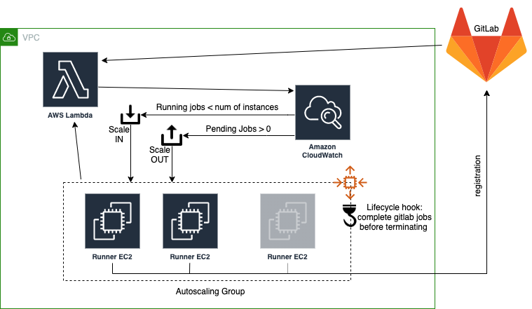

# GitLab runners in Autoscaling

## Overview
This module creates a set of gitlab runners in autoscaling group. The autoscaling group scales depending on the number of gitlab pending jobs and the load of the instances.

A lambda is in charge of collecting the metrics to trigger the scaling policies.

The autoscaling group makes use of Lifecycle hooks to ensure that every time a runner is asked for termination by the scaling-in operation, it completes the assigned job before terminating. 


## Architecture



## Inputs
The below outlines the required parameters.

| Name | Description | Type | Default |
|------|-------------|:----:|:-------:|
|vpc_id|VPC hosting the infrastructure|string|null|
|ssh_access->source_cidr|CIDR allowed for ssh login|string|null|
|ssh_access->key_name|Key to be used to launch EC2 instances|string|null|
|associate_public_ip_address|Associate a public address to instances in ASG (test purpose)|bool|false|
|gitlab->uri|Gitlab URI|string|null|
|gitlab->api_token_ssm_path|Gitlab API key|string|null|
|gitlab->runner_registration_token_ssm_path|Gitlab registration token for runners|string|null|
|gitlab->runner_agents_per_instance|Number of runner agents per instance|number|1|
|gitlab->narrow_to_membership|Process gitlab projects which the API key owner is member of|string|true|
|gitlab->log_level|Log level for the lambda which gather info on the number of gitlab pending/running jobs|string|info|
|asg->subnet_ids|List of subnet IDs assigned to the Auto Scaling group|string|null|
|asg->min_size|The minimum size of the Auto Scaling group|string|null|
|asg->max_size|The maximum size of the Auto Scaling group|string|null|
|asg->desired_capacity|Initial capacity of the Auto Scaling group|string|null|
|lambda_runtime|Lambda underlying execution environment. it must be a version of Python|string|python3.8|


## Example

The following code illustrates an usage example of this module:

```tf
module "gitlab-runner" {
    source                    = "git@gitlab.mantelgroup.com.au:cmd/tf-modules/cmd-tf-gitlab-runner.git"
    vpc_id = "vpc-08aba235436a32ea1"
    ssh_access = {
      source_cidr = "10.0.0.0/24"
      key_name = "gitlab-runner"
    }
    associate_public_ip_address = false
    gitlab = {
      uri = "https://gitlab.com"
      api_token_ssm_path = "/gitlab/api_token"
      runner_registration_token_ssm_path = "/gitlab/runner_registration_token"
      runner_agents_per_instance = 1
      narrow_to_membership = "true"
      log_level = "debug"
    }
    asg = {
      subnet_ids = ["subnet-0bf82dc96b889af9c", "subnet-0aaf01629503bbc39"]
      min_size             = 1
      max_size             = 3
      desired_capacity     = 1
    }
    lambda_runtime = "python3.8"
}
```